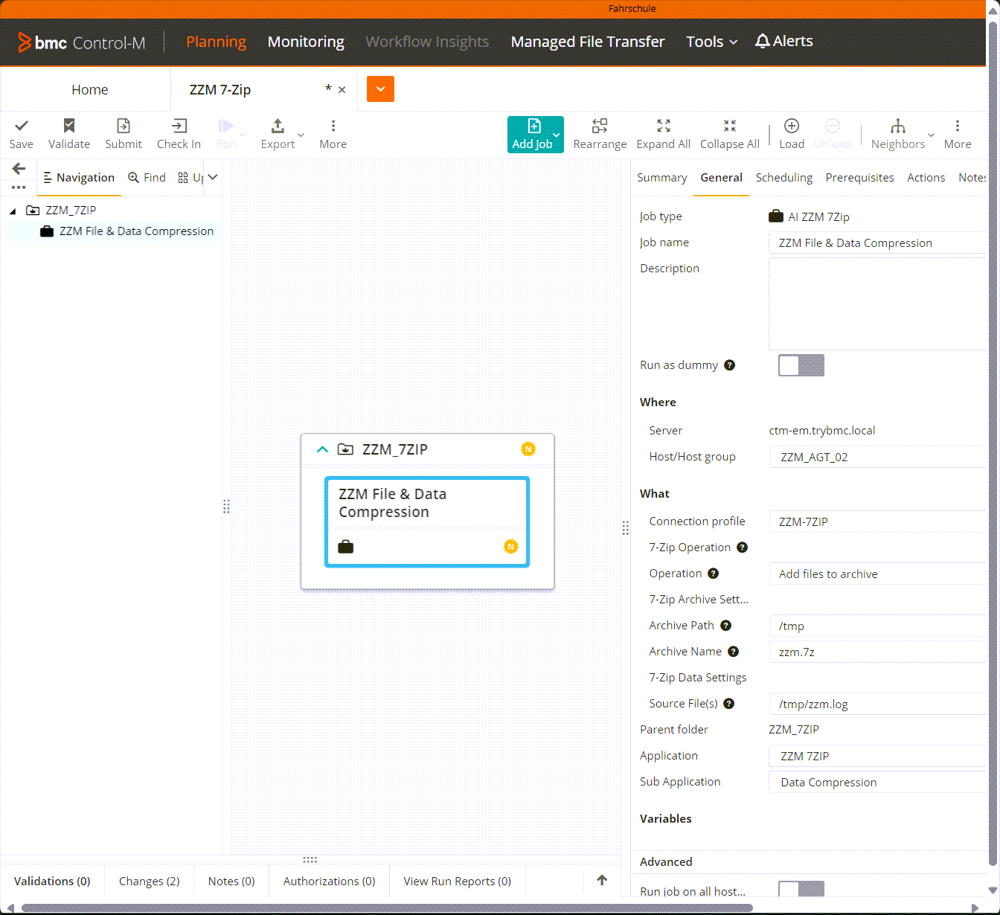

# ZZM7ZIP

Plug-In Name: ZZM 7Zip

Plug-In ID: ZZM7ZIP

Description: 7-Zip is a file archiver with a high compression ratio.

Operations:

- Add files to archive
- Benchmark
- Calculate hash
- Delete files from archive
- Extract without path
- Extract with full path
- Integrity Test
- List content
- Rename file
- Remove Archive

Runtime Parameters Attributes:

- Archive CRC Hash
- Archive MD5 Hash

Source: [**ZZM7ZIP.ctmai**](../src/7Zip/ZZM7ZIP.ctmai)

## Screenmshots

